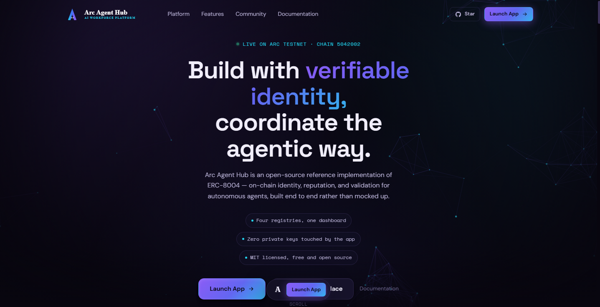
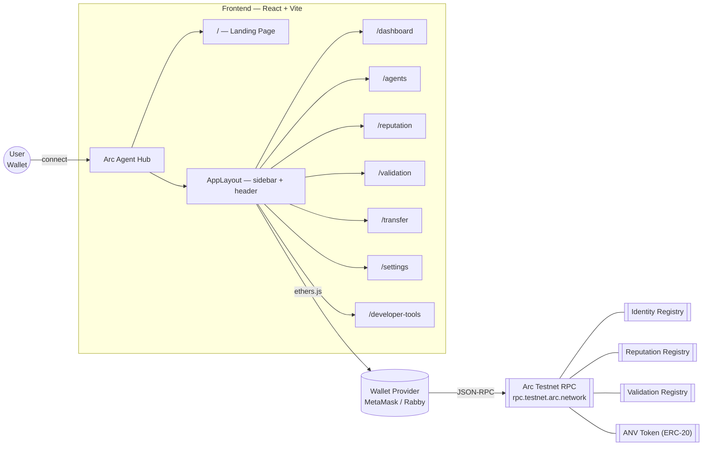
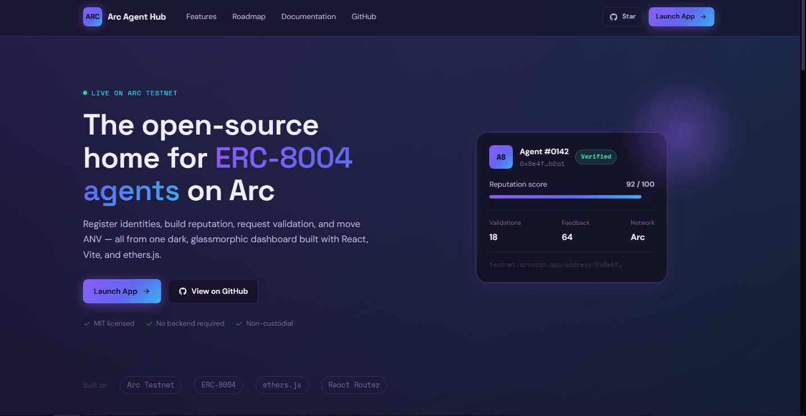
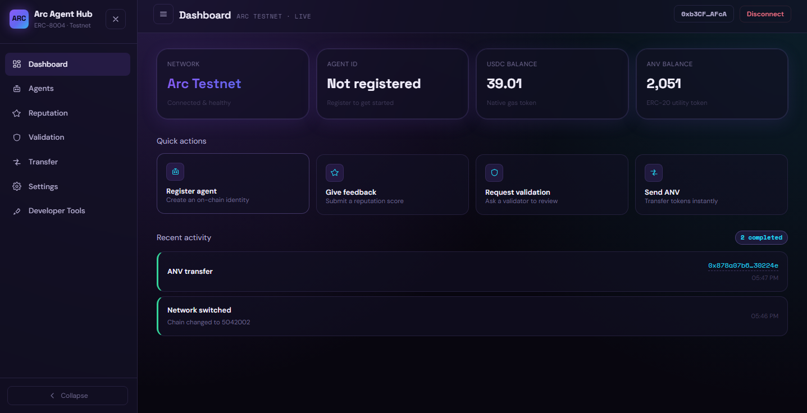
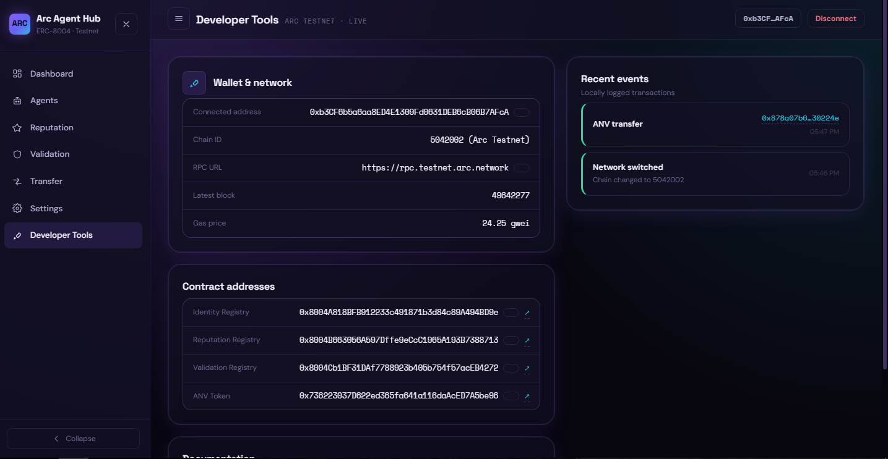

<div align="center">

<!--
  Hero banner — replace with a real 1280x400 banner (e.g. `.github/assets/banner.png`)
  showing the landing page hero or dashboard on a dark background.
-->


# Arc Agent Hub

**The open-source dashboard for ERC-8004 AI agent identities on Arc Testnet.**

Register agents, build reputation, request validation, and move ANV — from one dark, glassmorphic interface.

[](https://github.com/arc-agent-hub/arc-agent-hub/actions/workflows/build.yml)
[](https://github.com/arc-agent-hub/arc-agent-hub/actions/workflows/lint.yml)
[](./LICENSE)
[](https://react.dev)
[](https://vitejs.dev)
[](https://docs.arc.network)

[Live Demo](#) · [Report a Bug](.github/ISSUE_TEMPLATE/bug_report.yml) · [Request a Feature](.github/ISSUE_TEMPLATE/feature_request.yml) · [Documentation](./ARCHITECTURE.md)

</div>

---

## About

Arc Agent Hub is a reference implementation for the **ERC-8004 AI Identity Protocol** on **Arc Testnet**. It's built to be read, forked, and shipped from — a clean, feature-based React codebase with a single source of truth for contract addresses, chain config, and design tokens, so other builders can see exactly how an Arc-native dApp should be put together.

The app has two halves: a public marketing page (`/`) that anyone can visit, and a wallet-gated dashboard (`/dashboard`) where the actual on-chain actions happen.

## Features

| | |
|---|---|
| 🪪 **Agent Identity** | Register an ERC-8004 identity on-chain, with a verifiable profile, explorer link, and registration timestamp |
| ⭐ **Reputation** | Submit scored feedback (tag, evidence, comment) and track an agent's reputation timeline |
| 🛡️ **Validation** | Request a validator review and follow it from pending to completed, with full explorer traceability |
| 💸 **ANV Transfer** | Send ANV with a live balance, Max button, and recent-recipient history |
| 📊 **Live Dashboard** | Wallet balances, agent status, network health, and recent activity in one view |
| 🛠️ **Developer Tools** | Chain ID, RPC, current block, gas price, and a copy-ready contract registry |
| ⚙️ **Settings** | Theme toggle, network/contract info, activity export and reset |
| 🎨 **Design system** | Dark/light themes, glassmorphism, a shared token system, and a reusable component library in `src/ui/` |

## Architecture



See [ARCHITECTURE.md](./ARCHITECTURE.md) for the full folder-by-folder breakdown.

## Screenshots

<!-- Replace with real captures at `.github/assets/screenshot-*.png` -->

| Landing Page | Dashboard | Developer Tools |
|---|---|---|
|  |  |  |

## Demo

<!-- Replace with a real capture at `.github/assets/demo.gif` -->


## Installation

**Requirements:** Node.js 18+, npm 9+, and a browser wallet (MetaMask or Rabby).

```bash
git clone https://github.com/arc-agent-hub/arc-agent-hub.git
cd arc-agent-hub
npm install
```

## Quick Start

```bash
npm run dev
```

Open the printed local URL — you'll land on the marketing page. Click **Launch App** to reach `/dashboard`, connect a wallet, and approve the switch to **Arc Testnet** if prompted.

```bash
npm run build     # production build → dist/
npm run preview   # serve the production build locally
npm run lint       # run ESLint
```

## Configuration

Arc Agent Hub has no backend, no API keys, and no `.env` file to set up — every value it needs is committed in source, since none of it is secret:

| Setting | Location |
|---|---|
| Chain ID / RPC / Explorer | [`src/chains/arc.js`](./src/chains/arc.js) |
| Contract addresses / ABIs | [`src/contracts/registry.js`](./src/contracts/registry.js) |
| Design tokens (colors, fonts, spacing) | [`src/styles/tokens.css`](./src/styles/tokens.css) |
| Nav / route registry | [`src/app/nav.js`](./src/app/nav.js) |

If you fork this for a different network or deployment, those four files are the only places you should need to touch.

## Smart Contracts

| Contract | Address | Purpose |
|---|---|---|
| Identity Registry | `0x8004A818BFB912233c491871b3d84c89A494BD9e` | ERC-8004 agent identity registration |
| Reputation Registry | `0x8004B663056A597Dffe9eCcC1965A193B7388713` | Scored feedback for agents |
| Validation Registry | `0x8004Cb1BF31DAf7788923b405b754f57acEB4272` | Validator review requests |
| ANV Token | `0x736223037D622ed365fa641a116daAcED7A5be96` | ERC-20 token used across the app |

Addresses and ABIs live in one place — [`src/contracts/registry.js`](./src/contracts/registry.js) — so there's a single source of truth to verify against a fresh deployment.

## Arc Testnet

| | |
|---|---|
| Network name | Arc Testnet |
| Chain ID | `5042002` |
| RPC URL | `https://rpc.testnet.arc.network` |
| Block explorer | `https://testnet.arcscan.app` |
| Native currency | USDC |

The app will prompt to add/switch to Arc Testnet automatically on connect if your wallet isn't already on it.

## Deployment

Arc Agent Hub is a static site — build it and deploy the `dist/` folder anywhere that serves static files (Vercel, Netlify, Cloudflare Pages, GitHub Pages).

```bash
npm run build
```

**Vercel:** import the repo, framework preset `Vite`, build command `npm run build`, output directory `dist`.

**Netlify:** build command `npm run build`, publish directory `dist`.

No environment variables are required for either.

## Contributing

Contributions are welcome — see [CONTRIBUTING.md](./CONTRIBUTING.md) for the development workflow and our [Code of Conduct](./CODE_OF_CONDUCT.md) for community expectations. Found a security issue? See [SECURITY.md](./SECURITY.md) instead of opening a public issue.

## Roadmap

- [x] Core dashboard — identity, reputation, validation, transfer on Arc Testnet
- [x] Design system pass — glassmorphic UI, dark/light themes, shared component library
- [x] Public landing page
- [ ] Agent discovery — browse and search registered agents across the network
- [ ] Multi-chain support — extend the registry pattern beyond Arc Testnet

See [CHANGELOG.md](./CHANGELOG.md) for release history and [Releases](https://github.com/arc-agent-hub/arc-agent-hub/releases) for versioned notes.

## License

[MIT](./LICENSE) — free to use, fork, and ship.

---

<div align="center">
<sub>Built for the Arc developer community. Not affiliated with Circle.</sub>
</div>
